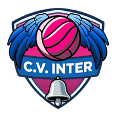

<p align="center">
  
</p>

<h1 align="center">InterZone</h1>

<p align="center">
  Pizarra táctica para diseñar, validar y estudiar sistemas de recepción y defensa de voleibol.
</p>

<p align="center">
  
  
  
  
  
  
</p>

---

## Índice

- [1. Descripción general del proyecto](#1-descripción-general-del-proyecto)
- [2. Stack tecnológico](#2-stack-tecnológico)
- [3. Arquitectura](#3-arquitectura)
- [4. Instalación y ejecución](#4-instalación-y-ejecución)
- [5. Estructura del proyecto](#5-estructura-del-proyecto)
- [6. Funcionalidades principales](#6-funcionalidades-principales)
- [7. Metodología de desarrollo](#7-metodología-de-desarrollo)
- [8. Documentación del proyecto](#8-documentación-del-proyecto)
- [9. Estado del proyecto](#9-estado-del-proyecto)

---

## 1. Descripción general del proyecto

**InterZone es una pizarra táctica de voleibol que valida y explica, no solo dibuja.**

El nombre describe lo que la herramienta hace de verdad: mirar **entre** las zonas. Lo
interesante de una recepción no está donde se coloca cada jugador, sino en las costuras que
quedan entre ellos. El objetivo no es un dibujo bonito, sino que un jugador entienda **por qué**
se coloca donde se coloca, y que un entrenador vea al instante si una formación es **legal** y si
deja **huecos** sin cubrir.

### El problema que resuelve

Un entrenador de 5-1 se enfrenta a tres problemas que las herramientas genéricas (pizarra de
vestuario, PowerPoint, apps de dibujo libre) no resuelven:

| Problema | Cómo lo aborda InterZone |
|---|---|
| **La falta de posición es contraintuitiva.** Depende de la posición rotacional (P1–P6), que cambia en cada rotación, no de dónde *parece* que está el jugador. | Valida en vivo las reglas de orden relativo y **bloquea el guardado** de una rotación ilegal (con opción de desactivar la validación para enseñar una excepción). |
| **El jugador memoriza posiciones, no entiende el porqué.** Seis dibujos sueltos no enseñan la lógica que los une. | Cada sistema, cada rotación y cada jugador pueden llevar su **texto de enseñanza**: la geometría viene acompañada del motivo. |
| **Los huecos de cobertura son invisibles en un dibujo.** Seis puntos sobre una pista no dicen qué trozo de campo no cubre nadie. | **Zonas de responsabilidad** pintadas sobre una rejilla de celdas de 0,5 m, con color por jugador y patrón de franjas donde dos se solapan. |

### La regla que gobierna el diseño

**Todo lo que se puede derivar, se deriva; nunca se almacena.** La posición rotacional, la
etiqueta de una ficha, quién está en pista, la situación de ataque rival, las infracciones, los
huecos y los conflictos. No es una preferencia estética: es lo que impide que la herramienta
enseñe algo falso porque un dato guardado se quedó viejo.

### Usuarios y roles

El acceso es por **lista blanca** (no hay registro abierto): el administrador invita un correo,
y esa invitación fija el rol con el que nace la cuenta y a qué equipo o equipos pertenece.

| | Admin | Entrenador | Usuario (jugador) |
|---|:---:|:---:|:---:|
| Consultar sistemas validados (**Teoría**) | todos | de sus equipos | de sus equipos |
| Crear, editar, clonar, borrar y validar sistemas (**Editor**) | cualquiera | de sus equipos | — |
| Examinarse y coleccionar medallas | sí | sí | sí |
| Gestionar la lista blanca | sí | — | — |
| Borrar una cuenta | sí | — | — |

### Contexto académico

Este repositorio es un Trabajo de Fin de Máster. Más allá del producto, el proyecto es un caso
de estudio de **desarrollo dirigido por especificación (SDD) combinado con TDD**, de
**arquitectura hexagonal** con un dominio puro compartido entre navegador y servidor, y de un
**registro de decisiones (ADR)** que documenta el porqué de cada elección estructural. Todo ello
está descrito en [`docs/`](docs/) y resumido en las secciones 7 y 8.

---

## 2. Stack tecnológico

### Frontend

| Tecnología | Uso |
|---|---|
| **Angular 22** | Aplicación SPA, componentes *standalone*, **signals**, **zoneless** (sin `zone.js`), `ChangeDetectionStrategy.OnPush`. |
| **TypeScript** (modo estricto) | Único lenguaje del dominio; sin dependencias de terceros en `domain/`. |
| **SVG nativo** | Todo el render de la pista se deriva de *signals*. Sin Canvas, sin Fabric.js, sin librerías de gráficos ([ADR 0003](docs/decisiones/0003-svg-en-lugar-de-canvas.md)). |
| **RxJS** | Solo lo que arrastra Angular; la orquestación de estado es con *signals*. |

### Backend

| Tecnología | Uso |
|---|---|
| **Node ≥ 22** + **Express 5** | API REST bajo `/api`. CORS, lectura de cookies y limitador de intentos escritos a mano, sin dependencias. |
| **Prisma 6** | ORM y migraciones. Los `CHECK` y la función `celdas_validas()` van a mano en el SQL de la migración. |
| **`tsx`** | Ejecución directa de TypeScript, también en producción (evita migrar la resolución de módulos del cliente generado por Prisma). |
| Dominio compartido | `server/` **importa `src/app/domain/` directamente**: las reglas de voleibol corren idénticas en Node y en el navegador ([ADR 0025](docs/decisiones/0025-el-servidor-importa-el-dominio.md)). |

### Datos

| Tecnología | Uso |
|---|---|
| **PostgreSQL 18** | Persistencia de equipos, jugadores, sistemas, formaciones, cuentas, sesiones y medallas. 11 tablas. |

### Calidad y tooling

| Tecnología | Uso |
|---|---|
| **Vitest 4** | 520 tests de dominio, aplicación e infraestructura (suite completa < 2 s); suite de integración del servidor aparte, contra un PostgreSQL real. |
| **Prettier 3** | Formato normalizado en todo `src/` y `server/src/`, con un *hook* `pre-commit` que rechaza el commit si algo no está formateado. |
| **graphify** | Grafo de conocimiento del repositorio (`graphify-out/`) para navegación y revisión de arquitectura. |

### Despliegue

| Tecnología | Uso |
|---|---|
| **Docker Compose** | Tres contenedores bajo un solo origen: `web` (nginx sirve el build y hace `proxy_pass` de `/api`), `servidor` y `postgres`. El mismo fichero despliega producción y desarrollo como dos *stacks* independientes en el mismo servidor (ADR 0044). |
| **nginx** | Estáticos con caché por tipo de recurso (inmutable para *bundles* con hash, `no-cache` para `index.html`), cabeceras CSP. |
| **PWA instalable** | *Service worker* de ~20 líneas escrito a mano: solo una página de cortesía sin conexión. Instalable ≠ *offline* — es deliberado. |

---

## 3. Arquitectura

Arquitectura hexagonal. **Las flechas de dependencia apuntan siempre hacia dentro.**

```
    ui/  ──────────►  application/  ──────────►  domain/
                            │                        ▲
                            ▼                        │
                    infrastructure/  ────────────────┘

    server/  ──────────────────────────────────────►  domain/
```

| Capa | Responsabilidad | Regla dura |
|---|---|---|
| `domain/` | Modelos y reglas del voleibol. Funciones puras y tipos. | **No importa nada externo**: ni Angular, ni el DOM, ni RxJS, ni librerías. Solo TypeScript. Cobertura de tests del 100 %. |
| `application/` | Orquestación y estado con *signals* (`SistemaStore`, `AccesoStore`, `TeoriaStore`, `ExamenStore`…). | Sin lógica de voleibol. Sin decoradores de Angular: testeable sin `TestBed`. |
| `infrastructure/` | Adaptadores hacia el exterior que implementan puertos declarados en `domain/`. | `HttpSistemaRepository` es el adaptador en uso; `localStorage` queda solo para ajustes de pantalla por dispositivo. |
| `ui/` | Componentes *standalone* de Angular. Leen *signals*, emiten intenciones. | No calculan nada del dominio, ni la etiqueta de una ficha. |
| `server/` | API REST Node/Express + PostgreSQL. Segundo consumidor de `domain/`. | Solo importa de `domain/`. Nunca de `application/`, `infrastructure/` ni `ui/`, y jamás al revés. |

> [!NOTE]
> El invariante *«`domain/` no importa nada»* es lo que permite que el mismo código de reglas
> corra en el navegador y en el servidor sin adaptador intermedio. Romperlo cuesta el doble
> desde que hay backend.

Detalle completo en [`docs/arquitectura.md`](docs/arquitectura.md); el porqué de cada decisión,
en [`docs/decisiones/`](docs/decisiones/) (44 ADR, *append-only*).

---

## 4. Instalación y ejecución

### Requisitos

- **Node ≥ 22.22.3** (frontend) y **Node ≥ 22** (backend).
- **Docker** para el PostgreSQL local.

> [!IMPORTANT]
> La pizarra pide el catálogo al arrancar y exige haber iniciado sesión, así que **hace falta
> el backend levantado y sembrado** para ver algo más que la pantalla de acceso. No basta con
> `npm install && npm start` en la raíz.

### 4.1 Backend (primera terminal)

```bash
cd server
npm install
cp .env.example .env
npm run db:up                # PostgreSQL en Docker (puerto 5432)
npx prisma migrate deploy    # aplica la migración, con sus CHECK a mano
npm run seed                 # equipos + catálogo de jugadores + 2 sistemas de ejemplo
npm run dev                  # http://localhost:3000
```

La semilla crea el equipo masculino con la recepción a 3 en 5-1 (6 rotaciones) y el sistema
defensivo (24 formaciones con sus zonas). El equipo femenino arranca vacío a propósito. El correo
de `ADMIN_EMAIL_INICIAL` (en `.env`) se invita como `admin`; esa persona completa su alta por el
registro normal.

Para un catálogo de prueba más completo — seis sistemas validados (recepción, defensa, en ambos
equipos) y la cuenta demo de la sección 4.5 — hay una segunda semilla, deliberadamente destructiva
(sustituye lo que ya exista con ese nombre), pensada para desarrollo, nunca para producción
([ADR 0045](docs/decisiones/0045-datos-de-prueba-en-desarrollo.md)):

```bash
npm run seed:pruebas
```

Rutas de la API y arranque detallado: [`server/README.md`](server/README.md).

### 4.2 Frontend (segunda terminal)

```bash
npm install
npm start                    # http://localhost:4200
```

`npm start` usa `proxy.conf.json` para reenviar `/api` al `:3000`, igual que hace nginx en
producción.

### 4.3 Tests

```bash
# Raíz — dominio, aplicación e infraestructura. Deben pasar siempre.
npm test
npm run typecheck

# Servidor — integración contra el PostgreSQL real de db:up (no dobles en memoria).
cd server
npm run db:up && npx prisma migrate deploy
npm test
```

### 4.4 Formato

```bash
npm run format         # formatea src/, server/src/ y la config raíz
npm run format:check   # solo comprueba
```

`npm install` instala un *hook* `pre-commit` que rechaza el commit si algún fichero *staged* no
está formateado (se salta con `git commit --no-verify`).

### 4.5 Despliegue en producción y en desarrollo

Tres contenedores Docker bajo un solo origen, detrás de un proxy inverso ya existente en el
servidor ([ADR 0041](docs/decisiones/0041-despliegue-en-un-solo-origen-y-pwa-instalable.md)).

Desde [ADR 0044](docs/decisiones/0044-produccion-y-desarrollo-en-la-misma-maquina.md) hay
**dos despliegues completos e independientes en el mismo servidor**, cada uno en su propio
clon del repositorio, con su propia base de datos y su propio dominio:

| | Producción | Desarrollo |
|---|---|---|
| URL | `cvinterzone.duckdns.org` | `dev.cvinterzone.duckdns.org` |
| Rama | `main` | `develop` |
| Copias de seguridad | sí | no |
| Acceso de prueba | — | `admin@cvinter.com` / `12345678` |

> [!NOTE]
> El acceso de prueba solo existe en el entorno de desarrollo — se siembra con
> `npm run seed:pruebas:prod` (ADR 0045) y sus credenciales son públicas a propósito, para que
> el tribunal del TFM pueda entrar sin pedir nada aparte. Nunca valen en producción.

```bash
cp .env.produccion.example .env    # o .env.desarrollo.example en el clon de desarrollo
# rellenar credenciales; .env nunca se commitea
./deploy.sh up -d --build

# Sembrar el catálogo base una sola vez, tras el primer arranque:
./deploy.sh exec servidor npm run seed:prod
```

`./deploy.sh` envuelve `docker compose` y añade `docker-compose.local.yml` cuando `ENTORNO=local`
(publica el puerto de `web` para abrir `http://localhost:8080` sin proxy real). Con
`ENTORNO=produccion` usa solo `docker-compose.prod.yml`. Es el mismo fichero de Compose para
los dos entornos: lo que los distingue (identidad de contenedores, rama a desplegar, aspecto
de la app) vive por completo en el `.env` de cada clon — ver el ADR 0044 y los comentarios de
`.env.produccion.example` / `.env.desarrollo.example`.

`deploy-servidor.sh` automatiza el ciclo completo (actualizar, reconstruir, migrar, sembrar) y
se ejecuta igual en los dos clones: lee de su propio `.env` qué rama traer y si le toca tomar
copias de seguridad.

Copias de seguridad (`copia-seguridad.sh`, `pg_dump -Fc`, rotación semanal por `cron`) — **solo
en el clon de producción**: [`docs/05_Copias_de_Seguridad.md`](docs/05_Copias_de_Seguridad.md).

---

## 5. Estructura del proyecto

```
inter-zone/
├── src/app/
│   ├── domain/                 # Reglas del voleibol. Sin imports externos. 100 % cubierto.
│   │   ├── modelos.ts          #   tipos: Punto, Jugador, Sistema, Formacion, Colocacion…
│   │   ├── roles.ts            #   configuración de roles, etiquetaDe()
│   │   ├── rotacion.ts         #   deriva P1–P6 ancladas al colocador; líbero en pista
│   │   ├── validacion.ts       #   validarFormacion(): falta / al_límite / válida
│   │   ├── defensa.ts          #   caso del colocador rival y situación de ataque
│   │   ├── rejilla.ts          #   celdas de 0,5 m, pintado por contorno (flood fill puro)
│   │   ├── sombra-bloqueo.ts   #   sombra del bloqueo (polígonos, Sutherland–Hodgman)
│   │   ├── examen.ts           #   examen por puesto / línea / sistema, nota e insignias
│   │   ├── acceso.ts           #   roles de acceso, lista blanca, perfil (sin crypto)
│   │   ├── insignias.ts        #   vitrina de medallas: bronce / plata / oro
│   │   ├── puertos.ts          #   interfaces de repositorio (sin implementación)
│   │   └── *.spec.ts           #   los tests, junto al fichero que prueban
│   ├── application/            # Stores con signals. Sin Angular, sin TestBed.
│   ├── infrastructure/         # Adaptadores HTTP (en uso) + localStorage para ajustes.
│   ├── ui/                     # Componentes standalone (app-*), OnPush, zoneless.
│   │   ├── tablero/  pista/  rotaciones/  panel/  sistemas/
│   │   ├── teoria/             #   pestaña de solo consulta
│   │   └── acceso/             #   entrar, perfil, vitrina de medallas, lista blanca
│   └── maqueta/                # Boceto congelado. No se renderiza ni se borra.
│
├── server/                     # Proyecto Node aparte (package.json y node_modules propios).
│   ├── prisma/
│   │   ├── schema.prisma
│   │   └── migrations/         #   CHECK y celdas_validas() a mano en el SQL
│   └── src/
│       ├── http/               #   Express: rutas (sistemas, auth, lista-blanca, examen)
│       ├── infraestructura/    #   Prisma, repositorios, contraseña (scrypt), sesión, semilla
│       └── main.ts
│
├── docs/                       # SDD: dominio, arquitectura, modelo de datos, ADR, specs.
│   ├── dominio.md              #   la fuente de verdad: reglas del voleibol
│   ├── arquitectura.md
│   ├── decisiones/             #   44 ADR, append-only
│   └── especificaciones/       #   63 specs (numeradas hasta la 067), una por entrega
│
├── docker-compose.prod.yml  ·  Dockerfile.web  ·  nginx.conf  ·  deploy.sh
└── public/                     # manifest PWA, iconos, service worker, medallas
```

Los tests viven **junto al fichero que prueban**, nunca en una carpeta paralela.

---

## 6. Funcionalidades principales

### Catálogo de sistemas

- Dos **equipos** fijos (masculino y femenino) y dos **tipos** de sistema (`recepción` y
  `defensa`). El nombre es único dentro de `(equipo, tipo)`.
- **Crear, renombrar, clonar y borrar** sistemas. Clonar puede llevar la copia a uno o a los dos
  equipos. Aviso de cambios sin guardar al cambiar de rotación, de sistema o de equipo.

### La pizarra (SVG)

- Media pista en SVG con `viewBox` **en metros reales** — nunca píxeles en el modelo.
- **Seis fichas arrastrables** con captura de puntero sobre el `<svg>`; banquillo con los
  jugadores sin colocar; selección de jugador por toque.
- Navegación **R1–R6**, donde `Rn` significa *«el colocador ocupa Pn»*.

### Validación de la falta de posición (recepción)

- Las tres reglas de orden relativo, evaluadas sobre las posiciones **derivadas** de la rotación.
- **Tres estados, no dos**, con margen `ε = 0,05 m`: `válida`, `al_límite`, `falta`. «Legal por
  tres centímetros» es información pedagógica, no un aprobado silencioso.
- **Guardar queda bloqueado** si hay infracción — o se permite a propósito desactivando la
  validación, para enseñar una excepción.

### Líbero

- Vive **fuera del orden de saque**: es un séptimo jugador, no el sexto.
- Sustituye a **cualquier titular de zaga** (regla FIVB 19.3.1.1), no solo al central. Como el
  sustituido cambia de línea al rotar, el líbero **entra y sale** de la formación solo.

### Sistemas de defensa

- Organizados por **caso del colocador rival** (delantero / trasero) y **situación de ataque**
  (inicial, por 4, por 3, por 2, por 1, pipe) — en defensa la rotación no manda nada.
- La situación se **deriva** de soltar la ficha del atacante en el campo rival, con el espejo de
  zonas ya resuelto. Seis puestos genéricos, sin validación de posición.
- **Variantes por número de bloqueadores** (0–3): quién bloquea se deriva de la distancia a la
  red, nunca se declara jugador a jugador.
- **Sombra del bloqueo**: la superficie que la pared de bloqueadores esconde al atacante, en
  polígonos, recalculada al mover al atacante o a un bloqueador y retocable a mano.

### Zonas de responsabilidad

- Rejilla de **celdas cuadradas de 0,5 m** sobre el campo propio de 9×9 m. Solo en defensa.
- **Pintado por arrastre** con relleno por contorno (flood fill puro, sin librerías).
- Todas las zonas visibles a la vez con paleta fija de 7 colores; la del jugador seleccionado a
  plena intensidad, las demás atenuadas; celdas compartidas con patrón de franjas.
- Segunda rejilla paralela para la **zona de finta**.

### Enseñanza

Tres niveles de texto, todos voluntarios: **descripción del sistema**, **explicación de
rotación** y **explicación de jugador** (por qué *ese* jugador se coloca ahí *en esa* rotación).

### Teoría (solo consulta)

Cualquier cuenta recorre los sistemas **validados** del equipo activo — rotación a rotación en
recepción, por caso/situación/bloqueadores en defensa — viendo fichas, zonas, sombra y
explicaciones exactamente como en el editor, sin poder tocar nada.

### Examen y medallas

- Tres tipos de examen: **por puesto**, **por línea** o **por sistema completo**. El líbero
  también puede ser sujeto de examen.
- Examen guiado: arrastre con faltas visibles solo al validar cada rotación, boletín con desglose
  por rotación y comparación con el modelo del entrenador.
- Nota de 0 a 10 que decae con la distancia al modelo; **insignia** (bronce / plata / oro) si la
  nota llega a 7 sin faltas.
- La ventana **Cuenta** tiene una vitrina de medallas: una pieza por sistema de recepción, con el
  desglose por puesto y el recuento de sistemas dominados.

### Cuentas, roles y lista blanca

- Alta con **correo y contraseña** solo si el admin invitó ese correo (lista blanca), que fija el
  rol y el equipo. Sesión de 30 días que se renueva con el uso; salir la invalida al instante.
- Toda `/api/sistemas` **exige sesión**; escribir exige además el rol adecuado.
- El admin gestiona la lista blanca **desde la propia aplicación**: invitar, reinvitar con otro
  rol, retirar.
- El admin también puede **borrar una cuenta de verdad** (sus membresías y su sesión desaparecen
  con ella), salvo que sea la última cuenta admin del sistema.
- La ventana **Cuenta**: correo y rol de solo lectura, nombre/apodo, posición favorita y dorsal
  (opcionales), y cambio de contraseña exigiendo acertar la actual.

### Persistencia y errores

- Los sistemas viven en **PostgreSQL**. **La escritura va siempre antes que el cambio local**
  ([ADR 0026](docs/decisiones/0026-escritura-antes-de-mutar-estado-local.md)): el store espera la
  respuesta del repositorio y solo entonces muta sus *signals*. Nada de UI optimista.
- Tres motivos de fallo distinguidos, cada uno con su aviso y su botón de reintentar: **sin
  conexión**, **error del servidor** y **conflicto de edición** (detectado con `If-Match`).
- Los **ajustes de pantalla** (validación desactivada, ayuda de posición…) siguen en
  `localStorage`, por dispositivo: son preferencias, no trabajo que perder.

---

## 7. Metodología de desarrollo

El proyecto se construye con **SDD + TDD**, un escenario cada vez:

```
1. Escribir la spec        docs/especificaciones/NNN-nombre.md
2. Escenarios verificables  Dado / Cuando / Entonces, con id E1, E2…
3. Congelar la spec         antes de ver una línea de implementación
4. Test en rojo             uno por escenario; el fallo debe ser una aserción
5. Código mínimo            hasta que pase. Nada más.
6. Refactor                 con la suite en verde; los tests no se tocan
7. Cerrar la spec           marcar Completada y anotar las desviaciones reales
```

- **SDD decide el qué y el porqué**: la spec enumera los casos límite pensándolos desde el
  reglamento, no descubriéndolos con el código delante.
- **TDD decide el cómo**: ningún código de producción antes de un test que falle, y el fallo debe
  ser una aserción, nunca un `ReferenceError`.
- **La especificación dice qué y por qué; los tests dicen cómo se verifica.** El vínculo se
  mantiene con el id del escenario (`it('E4: falta si P1 está por delante de P2')`), no copiando
  frases.
- Cada decisión estructural que sobrevive a una spec se registra en un **ADR** en
  `docs/decisiones/` (nunca se edita ni se borra uno existente).

Detalle en [`docs/flujo-de-trabajo.md`](docs/flujo-de-trabajo.md).

---

## 8. Documentación del proyecto

| Documento | Para qué |
|---|---|
| [`docs/dominio.md`](docs/dominio.md) | Las reglas del voleibol y el vocabulario del proyecto. **La fuente de verdad.** |
| [`docs/arquitectura.md`](docs/arquitectura.md) | Capas, dependencias permitidas, estructura de carpetas — incluye `server/`. |
| [`docs/modelo-de-datos.md`](docs/modelo-de-datos.md) | El esquema de PostgreSQL: las 11 tablas y las ampliaciones previstas. |
| [`docs/flujo-de-trabajo.md`](docs/flujo-de-trabajo.md) | Cómo se trabaja aquí: el ciclo SDD + TDD. |
| [`docs/05_Copias_de_Seguridad.md`](docs/05_Copias_de_Seguridad.md) | Qué se guarda, cómo comprobarlo, cómo restaurar. |
| [`docs/decisiones/`](docs/decisiones/) | 44 ADR: cada decisión estructural y su motivo. Solo se añade. |
| [`docs/especificaciones/`](docs/especificaciones/) | 63 specs (numeradas hasta la 067), una por porción de trabajo. Se cierran al terminarse. |
| [`server/README.md`](server/README.md) | Arranque del backend, rutas de la API, estructura de `server/`. |
| [`CLAUDE.md`](CLAUDE.md) | Contexto e invariantes para asistentes de IA. |

---

## 9. Estado del proyecto

| | |
|---|---|
| Specs escritas | 63 (numeradas hasta la 067; huecos reservados 014–016) |
| ADR registradas | 44 |
| Tests | 520 (dominio · aplicación · infraestructura) + integración de servidor |
| Tablas construidas | 11 |
| Adaptador de persistencia en uso | `HttpSistemaRepository` |
| Autenticación | lista blanca + contraseña + sesión |

Cada entrega es **usable en un entrenamiento por sí sola**; ese es el criterio de corte. Lo
construido hasta hoy: dominio con tests, catálogo de sistemas, pizarra interactiva, líbero por
rotación, sistemas de defensa con zonas y sombra, backend con PostgreSQL, cuentas y roles,
Teoría, y examen con medallas.
