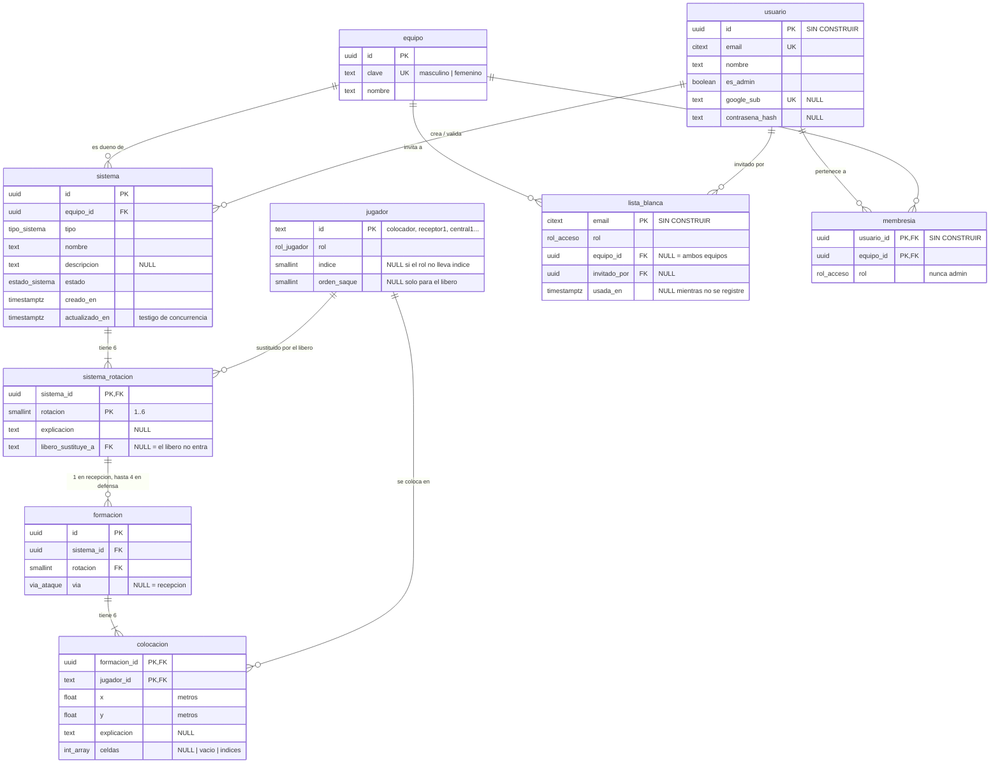

# 03 — Base de datos

> Documento de lectura. El diseño completo y razonado está en `docs/modelo-de-datos.md`;
> el esquema ejecutable, en `server/prisma/schema.prisma` y `server/prisma/migrations/`.

---

## 1. Tipo de base de datos

**Relacional: PostgreSQL 15 o superior**, con Prisma como ORM y motor de migraciones.

Requiere 15 por `UNIQUE NULLS NOT DISTINCT`, que aquí no es un lujo: sin él, dos formaciones de
recepción de la misma rotación (ambas con `via` nula) no colisionarían, porque `NULL ≠ NULL`.

En desarrollo, un Postgres en Docker (`npm run db:up` dentro de `server/`).

### Por qué relacional y normalizado hasta la colocación

Un motor documental habría guardado cada sistema como un JSON y se acabó. Se descartó por tres
motivos, en orden de peso:

1. **Modificar un sistema pasa a ser un `UPDATE` de una fila**, no reescribir el documento
   entero. Es lo que hace posible enseñar el *diff* antes de aplicarlo, revertirlo, y que dos
   ediciones simultáneas no se pisen. Con el sistema como documento único, ninguna de las tres
   cosas es posible.
2. **Los invariantes de voleibol se pueden expresar como restricciones.** «El líbero no ocupa
   plaza en el orden de saque» es un `CHECK` de una línea.
3. **Es lo que hará falta cuando una IA redacte sistemas desde texto** — la ampliación que ya
   está prevista.

### Principios de diseño

1. **Nada derivado se almacena** (sección 6).
2. **Metros, nunca píxeles** — no cambia porque ahora haya una base de datos.
3. **Sencillo, pero sin condenarse a rehacerlo.** Nueve tablas, ninguna columna especulativa.
   Todo lo previsible entra como fila nueva o tabla nueva, jamás como `ALTER` de lo ya escrito.
4. **La base rechaza lo imposible; la aplicación decide lo discutible.** Una rotación 7 o una
   celda 400 no deben poder escribirse. Una formación con falta de posición, en cambio, es un
   dato legítimo.

### Estado: 6 tablas de 9

| Construidas (spec 033) | Diseñadas, **aplazadas** (ADR 0028) |
|---|---|
| `equipo`, `jugador`, `sistema`, `sistema_rotacion`, `formacion`, `colocacion` | `usuario`, `lista_blanca`, `membresia` |

---

## 2. Aviso de vocabulario: «rol» significa tres cosas

| Concepto | Valores | Enumerado |
|---|---|---|
| **Rol de acceso** — qué puede hacer una persona | admin, entrenador, usuario | `rol_acceso` |
| **Rol de voleibol** — de qué juega una ficha | colocador, receptor, central, opuesto, líbero | `rol_jugador` |
| **Posición rotacional** — obligación reglamentaria | P1..P6 | *ninguno: se deriva, no se almacena* |

Los enumerados se llaman distinto a propósito. Si lees `rol` a secas en una consulta, mira esta
tabla antes de suponer cuál es.

---

## 3. Diagrama entidad-relación



---

## 4. Relaciones en prosa

| Relación | Cardinalidad | Detalle |
|---|---|---|
| `equipo` → `sistema` | **1:N** | Un equipo tiene muchos sistemas; un sistema pertenece a exactamente un equipo. `ON DELETE RESTRICT`: no se borra un equipo con sistemas dentro. |
| `sistema` → `sistema_rotacion` | **1:6, exactamente** | Las seis filas se insertan al crear el sistema. Que sean **seis** no es expresable como restricción de tabla —es una condición sobre el conjunto de filas—, así que es un **invariante de creación**. `ON DELETE CASCADE`. |
| `sistema_rotacion` → `formacion` | **1:1 en recepción, 1:N (hasta 4) en defensa** | La clave ajena es compuesta `(sistema_id, rotacion)` y apunta a `sistema_rotacion`, **no a `sistema`**: una sola clave que además garantiza que la rotación existe antes de colgarle formaciones. |
| `formacion` → `colocacion` | **1:6** | Una por jugador en pista. Lo comprueba la aplicación (`guardarFormacion`), no la base. |
| `jugador` → `colocacion` | **1:N** | El catálogo fijo de siete huecos aparece en muchas colocaciones. `ON DELETE RESTRICT`. |
| `jugador` → `sistema_rotacion` | **1:N, opcional** | A quién sustituye el líbero en esa rotación. `NULL` = no entra. |
| `usuario` ↔ `equipo` vía `membresia` | **N:M** | Tabla puente con rol. Un entrenador lleva los dos equipos con dos filas. *(sin construir)* |
| `usuario` → `sistema` | **1:N, dos veces** | `creado_por` y `validado_por`, ambos `ON DELETE SET NULL`. *(sin construir)* |
| `equipo` → `lista_blanca` | **1:N, opcional** | `equipo_id` nulo significa «ambos equipos». *(sin construir)* |

---

## 5. Enumerados

```sql
CREATE TYPE rol_acceso     AS ENUM ('admin', 'entrenador', 'usuario');   -- sin construir
CREATE TYPE rol_jugador    AS ENUM ('colocador', 'receptor', 'central', 'opuesto', 'libero');
CREATE TYPE tipo_sistema   AS ENUM ('recepcion', 'defensa');
CREATE TYPE via_ataque     AS ENUM ('z4', 'z3', 'z2', 'pipe');
CREATE TYPE estado_sistema AS ENUM ('borrador', 'validado');
```

`rol_jugador`, `tipo_sistema` y `via_ataque` son **copia literal** de `RolId`, `TipoSistema` y
`ViaAtaque` en `src/app/domain/modelos.ts`. No se traducen ni se reordenan: los mismos literales
viajan de la base de datos al dominio sin capa intermedia.

**El equipo no es un enumerado, es una tabla.** Con dos filas hoy, pero el día que aparezca un
cadete o un juvenil eso es un `INSERT` y no una migración.

---

## 6. Esquema tabla a tabla (las 6 construidas)

### `equipo`

| Columna | Tipo | Nulo | Único | Nota |
|---|---|---|---|---|
| `id` | `uuid` | no | **PK** | |
| `clave` | `text` | no | **sí** | Identificador estable que usa el código: `masculino`, `femenino`. |
| `nombre` | `text` | no | no | Lo que se ve en el desplegable. Puede cambiar sin romper nada. |

Mismo criterio que `RolId` frente a `DefinicionRol.nombre`: **el identificador es estable, el
nombre visible es configuración.**

### `jugador` — catálogo fijo de siete huecos

| Columna | Tipo | Nulo | Único | Nota |
|---|---|---|---|---|
| `id` | `text` | no | **PK** | Literalmente el mismo string que usa la app. Sin traducción. |
| `rol` | `rol_jugador` | no | ver abajo | |
| `indice` | `smallint` | **sí** | ver abajo | `CHECK (indice IN (1, 2))`. Nulo si el rol no lleva índice. |
| `orden_saque` | `smallint` | **sí** | **sí** | `CHECK (BETWEEN 1 AND 6)`. **Nulo solo para el líbero.** |

Contenido completo, sembrado:

```sql
INSERT INTO jugador (id, rol, indice, orden_saque) VALUES
  ('colocador', 'colocador', NULL, 1),  -- P1 -> C
  ('receptor1', 'receptor',  1,    2),  -- P2 -> R1
  ('central2',  'central',   2,    3),  -- P3 -> C2
  ('opuesto',   'opuesto',   NULL, 4),  -- P4 -> O
  ('receptor2', 'receptor',  2,    5),  -- P5 -> R2
  ('central1',  'central',   1,    6),  -- P6 -> C1, el central contiguo al colocador
  ('libero',    'libero',    NULL, NULL);
```

**Léase esto antes de tocar la tabla.** Estas siete filas **no son jugadores del equipo: son los
siete huecos del sistema.** «El colocador», «el central que arranca junto a él», «el líbero».
Quién los ocupa el martes que viene no se guarda en ninguna parte, y es a propósito: a este
nivel una misma persona juega en varios puestos según el día.

Por eso llevan `rol`, y por eso el rol **no** es «de qué juega Fulanito»: define el hueco, y de
él dependen tres cosas que se romperían si se quitara — la regla de que el líbero no puede
ocupar P2/P3/P4, las etiquetas que se pintan en cada ficha, y el reparto por zonas del sistema
de defensa sembrado.

Restricciones que merecen atención:

```sql
CONSTRAINT jugador_libero_fuera_del_orden
  CHECK ((rol = 'libero') = (orden_saque IS NULL))          -- la ADR 0014 en una línea

CREATE UNIQUE INDEX jugador_rol_indice_key
  ON jugador (rol, indice) NULLS NOT DISTINCT;
```

Ese último expresa **de una tacada** los invariantes 7 y 8 del dominio: un colocador, un
opuesto, un líbero, R1 ≠ R2, C1 ≠ C2. Con un `UNIQUE` normal no funcionaría: dos `NULL` se
consideran distintos y colarían dos colocadores.

### `sistema`

| Columna | Tipo | Nulo | Único | Nota |
|---|---|---|---|---|
| `id` | `uuid` | no | **PK** | |
| `equipo_id` | `uuid` | no | ver abajo | FK → `equipo(id)`, `ON DELETE RESTRICT`. |
| `tipo` | `tipo_sistema` | no | ver abajo | |
| `nombre` | `text` | no | ver abajo | `CHECK (btrim(nombre) <> '')`. |
| `descripcion` | `text` | **sí** | no | Descripción general, independiente de la rotación (spec 025). |
| `estado` | `estado_sistema` | no | no | Por defecto `'borrador'`. **Nada la lee ni la cambia todavía.** |
| `creado_en` | `timestamptz` | no | no | Por defecto `now()`. |
| `actualizado_en` | `timestamptz` | no | no | **Testigo de concurrencia.** |
| `creado_por` | `uuid` | sí | no | *Aplazada* — FK → `usuario`, que no existe. |
| `validado_por` | `uuid` | sí | no | *Aplazada.* |
| `validado_en` | `timestamptz` | sí | no | *Aplazada.* |

- **`UNIQUE (equipo_id, tipo, nombre)`.** Masculino y femenino pueden tener cada uno su «5-1» de
  recepción sin pisarse, y el mismo nombre puede repetirse entre recepción y defensa.
- **`actualizado_en` hace de testigo de concurrencia.** Con un
  `WHERE id = $1 AND actualizado_en = $2`, la escritura tardía falla en vez de ganar. **No hace
  falta columna de versión.**
- El `CHECK sistema_validado_con_fecha` mira `validado_en`, **no `validado_por`**, y es
  deliberado: con `ON DELETE SET NULL`, borrar a la persona que validó volvería a evaluar el
  `CHECK` y el borrado fallaría. Así, un sistema validado sigue validado aunque su validador ya
  no esté; solo se pierde el nombre. *(Llega con la migración de acceso.)*
- Índice: `(equipo_id, tipo, estado)`.

### `sistema_rotacion`

| Columna | Tipo | Nulo | Único | Nota |
|---|---|---|---|---|
| `sistema_id` | `uuid` | no | **PK** | FK → `sistema(id)`, `ON DELETE CASCADE`. |
| `rotacion` | `smallint` | no | **PK** | `CHECK (BETWEEN 1 AND 6)`. |
| `explicacion` | `text` | **sí** | no | Enseñanza de conjunto de esa rotación. |
| `libero_sustituye_a` | `text` | **sí** | no | FK → `jugador(id)`, `RESTRICT`. `CHECK (<> 'libero')`. |

**Dos cosas en una tabla porque las dos van por `(sistema, rotación)`.** Tenerlas separadas
serían dos tablas con la misma clave primaria.

**En defensa una rotación tiene cuatro formaciones pero una sola explicación de rotación.** Por
eso esto no cuelga de `formacion`: colgaría cuatro copias del mismo texto.

`libero_sustituye_a` nulo = en esa rotación el líbero no entra.

### `formacion`

| Columna | Tipo | Nulo | Único | Nota |
|---|---|---|---|---|
| `id` | `uuid` | no | **PK** | |
| `sistema_id` | `uuid` | no | ver abajo | FK compuesta → `sistema_rotacion`, `CASCADE`. |
| `rotacion` | `smallint` | no | ver abajo | Parte de la misma FK compuesta. |
| `via` | `via_ataque` | **sí** | ver abajo | **Nula = recepción.** Con valor = defensa. |

```sql
CREATE UNIQUE INDEX formacion_sistema_id_rotacion_via_key
  ON formacion (sistema_id, rotacion, via) NULLS NOT DISTINCT;
```

Aquí `NULLS NOT DISTINCT` es **imprescindible**: con la regla normal, dos formaciones de
recepción de la misma rotación (ambas con `via` nula) no colisionarían.

*Endurecimiento posible, no incluido:* que un sistema de recepción no pueda tener formaciones
con vía, y uno de defensa no pueda tenerlas sin ella. Se deja fuera por sencillez; la aplicación
ya lo garantiza. **Si algún día una IA escribe formaciones directamente, este es el primer
candado que hay que poner.**

### `colocacion`

| Columna | Tipo | Nulo | Único | Nota |
|---|---|---|---|---|
| `formacion_id` | `uuid` | no | **PK** | FK → `formacion(id)`, `CASCADE`. |
| `jugador_id` | `text` | no | **PK** | FK → `jugador(id)`, `RESTRICT`. |
| `x` | `double precision` | no | no | Metros. `CHECK (BETWEEN -2.5 AND 11.5)`. |
| `y` | `double precision` | no | no | Metros. `CHECK (BETWEEN 0 AND 12)`. |
| `explicacion` | `text` | **sí** | no | Enseñanza de ese jugador en esa rotación. |
| `celdas` | `integer[]` | **sí** | no | Tres estados, ver abajo. `CHECK (celdas IS NULL OR celdas_validas(celdas))`. |

**Las coordenadas van en `double precision`, sin escala fijada.** La spec 008 E6 exige que los
decimales lleguen exactos, sin redondear. Un `numeric(4,2)` con la escala inventada rompería ese
escenario.

**`y` nunca es negativa: nadie del propio equipo pasa la red.** Escribir el modelo de datos
destapó que la pizarra sí lo permitía (`LIMITE_Y` valía `[-3.6, 9.3]`), y se corrigió. El campo
rival (`y < 0`) es solo para la ficha rival, de la que además **no se persiste ninguna posición**
(ADR 0020).

Los `CHECK` de rango sirven para atajar disparates —una `x` de 500, lo que escribiría un modelo
que se inventa una formación—, no para arbitrar reglas de voleibol.

#### Los tres estados de `celdas`

| Valor | Significado |
|---|---|
| `NULL` | **Nunca se tocó.** Se muestra el bloque 2×2 por defecto derivado del punto. |
| `'{}'` | **Vaciada a propósito.** Cero celdas, sin bloque por defecto. |
| `{12,13,30,31}` | Zona pintada a mano. |

Con filas hijas en vez de array, «ninguna fila» significaría las dos primeras cosas a la vez, y
haría falta una bandera extra. El otro motivo para el array es **volumen**: un sistema de
defensa completo son 24 formaciones × 6 jugadores, y cada zona son decenas de celdas —
normalizadas rondarían las decenas de miles de filas por sistema, sin ganar ninguna consulta.

#### Índice lineal de celda

```
indice = fila * 18 + columna        fila = indice / 18       columna = indice % 18
```

18×18 = 324 celdas de 0,5 m sobre el campo propio de 9×9 m. De ahí el rango `0..323`:

```sql
CREATE FUNCTION celdas_validas(celdas integer[]) RETURNS boolean
  LANGUAGE sql IMMUTABLE PARALLEL SAFE AS $$
    SELECT coalesce(bool_and(c BETWEEN 0 AND 323), true)
       AND count(*) = count(DISTINCT c)
    FROM unnest(celdas) AS c;
  $$;
```

Comprueba rango y ausencia de duplicados. Sobre un array vacío los agregados dan `true`, que es
justo lo que hace falta para que `'{}'` pase.

> **Nota de implementación:** esta columna se lee y se escribe con **SQL a mano** en
> `server/src/infraestructura/sistema.repositorio.ts`, no con el cliente generado. Prisma no
> admite «lista opcional» en su lenguaje de esquema (`Int[]?` no es válido) y su cliente tipado
> no deja escribir `NULL` en una columna array aunque la columna sí lo permita.

---

## 7. Las 3 tablas de acceso (diseñadas, sin construir)

### `usuario`

Campos de identidad (`email` como `citext` y único, `nombre`, `es_admin`, `google_sub` único,
`contrasena_hash`, `creado_en`, `ultimo_acceso_en`) **más los cuatro ajustes de pantalla** como
columnas booleanas: `validacion_desactivada`, `ayuda_posicion_desactivada`,
`orden_rotacion_cronologico`, `mostrar_numeros_metros`.

```sql
CONSTRAINT usuario_tiene_forma_de_entrar
  CHECK (google_sub IS NOT NULL OR contrasena_hash IS NOT NULL)
```

**Las dos vías de entrada conviven.** Ambas opcionales, pero al menos una tiene que estar: quien
se registró con contraseña puede enlazar Google después sin acabar con dos usuarios y dos
catálogos.

Los cuatro booleanos van aquí y no en una tabla aparte porque son cuatro banderas de una fila:
una tabla 1:1 no aportaría nada. Hasta que exista `usuario`, siguen en `localStorage`.

### `lista_blanca`

`email` (PK, `citext`), `rol`, `equipo_id` (nulo = ambos equipos), `invitado_por`, `creado_en`,
`usada_en`.

**Es la única puerta.** No hay registro abierto. Al entrar por primera vez la fila se traduce a
`usuario` + `membresia`, y se sella `usada_en`. **A partir de ese momento la lista blanca es
historia, no fuente de verdad**: para cambiar permisos se tocan `usuario` y `membresia`, no la
invitación. Sin esa regla acabaríamos con dos sitios que dicen cosas distintas sobre la misma
persona.

### `membresia`

`(usuario_id, equipo_id)` como PK, más `rol`, con `CHECK (rol <> 'admin')` — el admin no está
acotado a ningún equipo, así que no aparece aquí.

**Los permisos sobre un sistema salen del rol en el equipo dueño de ese sistema.** No hay
permisos sistema a sistema, que obligarían a una fila por cada par (persona, sistema) y a
acordarse de darlos cada vez que se crea uno.

### Pendiente de diseñar

**Cómo se guarda una sesión** — cookie firmada, JWT, tabla de tokens. No hay ni una mención a
sesión, token o cookie en todo el modelo de datos. Era requisito previo de la spec 035, hoy
aplazada (ADR 0028), así que la decisión se aplaza con ella.

---

## 8. Lo que NO va en la base de datos

Es la sección que hay que releer contra el DDL antes de dar un esquema por bueno.

### Derivado, nunca almacenado

| Dato | Se deriva de | Función |
|---|---|---|
| Posición rotacional P1..P6 | orden de saque + rotación | `formacionEnRotacion` |
| Quién está en pista | sustituto del líbero + rotación | `jugadoresEnPista` |
| Etiqueta (`C`, `R1`, `C2`, `O`, `L`) | rol + configuración + índice | `etiquetaDe` |
| Vía de ataque | punto del rival | `viaDeAtaque` (solo se guarda la vía ya resuelta) |
| Zona por defecto 2×2 | el punto del jugador | `bloquePorDefecto` |
| Infracciones y avisos | la formación | `validarFormacion` |
| Huecos y conflictos | las celdas de todos | todavía sin implementar |

### La falta de posición no es un `CHECK`

Parecería el candado ideal, y sería un error: la spec 017 permite desactivar la validación y la
026 contempla guardar a propósito una formación «con falta» para enseñar el error. **Un sistema
con formaciones ilegales es un dato legítimo.**

### Condiciones sobre conjuntos de filas, no sobre una fila

No caben en una restricción de tabla; se quedan en la aplicación:

- «Exactamente seis colocaciones, y justo el roster de esa rotación» → `guardarFormacion` /
  `guardarFormacionDefensa`.
- «Seis filas de `sistema_rotacion` por sistema» → invariante de creación.
- «Exactamente 1 colocador, 2 receptores, 2 centrales y 1 opuesto» → `validarPlantilla`. El
  catálogo fijo de siete filas lo cumple por construcción.

### Fechas fuera del dominio (ADR 0012)

`creado_en` y `actualizado_en` son columnas de infraestructura. **No entran en el tipo `Sistema`
de dominio.** El testigo de concurrencia viaja en la frontera HTTP como un campo añadido
(`actualizadoEn`) y vive en el adaptador, en un `Map` en memoria por id.

---

## 9. Correspondencia con el modelo de la aplicación

| Modelo TypeScript | Tabla y columna |
|---|---|
| `Sistema.id`, `.nombre`, `.tipo`, `.descripcion` | `sistema` |
| `Sistema.equipoId` | `sistema.equipo_id` (vía `equipo.clave`) |
| `Sistema.plantilla` | catálogo fijo `jugador` — **no se guarda por sistema** |
| `SustitucionLibero.sustitutosPorRotacion[n]` | `sistema_rotacion.libero_sustituye_a` |
| `Sistema.explicacionesRotacion[n]` | `sistema_rotacion.explicacion` |
| `Sistema.formaciones[n]` | `formacion` con `via IS NULL` |
| `Sistema.defensas[n][via]` | `formacion` con `via` |
| `Colocacion.jugador.id` | `colocacion.jugador_id` |
| `Colocacion.punto.x` / `.y` | `colocacion.x` / `.y` |
| `Colocacion.explicacion` | `colocacion.explicacion` |
| `Colocacion.celdas` | `colocacion.celdas` (índice lineal) |
| `Ajustes` (los cuatro) | columnas de `usuario` *(plan)* — hoy en `localStorage` |

**Los siete `jugador.id` son literalmente los strings que la app ya usa**, así que una
`Colocacion` se reensambla sin traducir nada.

**Aviso histórico:** `central1` y `central2` estaban cruzados respecto a sus etiquetas y se
enderezaron al fijar el esquema (ADR 0022). Las etiquetas en pantalla no cambiaron; solo el
identificador interno. Se hizo entonces precisamente porque el único dato en riesgo estaba en el
navegador de una persona, todavía no en la base de datos.

---

## 10. Ampliaciones que no tocarán el esquema

Ninguna requiere `ALTER` de las nueve tablas — que es lo que se pedía al diseñarlo.

| Ampliación | Cómo entra |
|---|---|
| Un tercer equipo (cadete, juvenil) | `INSERT` en `equipo` |
| Jugadores con nombre real | Tabla nueva enlazada, **sin rol fijo**; los siete huecos siguen intactos |
| Varias alineaciones por equipo | Tabla nueva, con `sistema` apuntando a ella |
| Modo examen | `intento_examen` e `intento_colocacion`, colgando de `sistema` y `usuario` |
| IA que redacta sistemas | Tabla de auditoría: petición, antes, después |
| Renombrar roles por equipo («Receptor» → «Punta») | Tabla de configuración de roles |

---

## 11. Operativa

```bash
cd server
npm run db:up               # Postgres en Docker, puerto 5432
npx prisma migrate deploy   # aplica migraciones, con sus CHECK a mano
npm run seed                # equipo + jugador + los dos sistemas de ejemplo
npm run db:down             # parar
```

**Regla de oro al migrar:** `prisma migrate dev --create-only`, **editar el `.sql` a mano** para
añadir los `CHECK`, y solo entonces aplicar. Prisma no expresa `CHECK` ni
`UNIQUE NULLS NOT DISTINCT`, y aquí **casi todos los invariantes de voleibol son `CHECK`s**.

**Versionado:** migraciones de Prisma. El patrón de la v1 (un documento con número de versión,
que se descartaba entero si no coincidía) **dejó de valer para los sistemas** — contra una base
de datos eso sería borrar el trabajo de un equipo. Sigue vivo, a propósito, en
`LocalStorageAjustesRepository`, donde el dato son cuatro banderas de pantalla.
