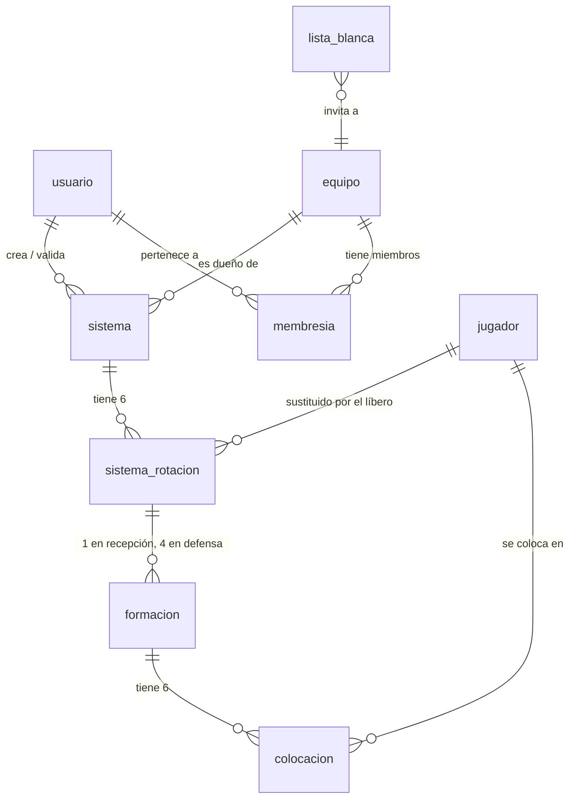

# Modelo de datos relacional (PostgreSQL)

Esquema de la base de datos de la V2, con backend Node y PostgreSQL. Sale de los requisitos de
datos que ya existen en la aplicación más los que añade el paso a multiusuario.

**Esto no es una spec.** No tiene escenarios Dado/Cuando/Entonces y sí habla de implementación, que
es justo lo que `docs/flujo-de-trabajo.md` prohíbe en una spec. Es un documento de diseño previo:
fija la forma de los datos para que la spec que venga después pueda escribirse en lenguaje de
voleibol sin tener que discutir tablas por el camino.

**Seis de las nueve tablas ya están construidas** (spec 033): `equipo`, `jugador`, `sistema`,
`sistema_rotacion`, `formacion`, `colocacion`. Las tres de acceso —`usuario`, `lista_blanca`,
`membresia`— siguen sin construir, y llegan con las specs 035-037. Ver la sección 9, al final.

## Aviso de vocabulario: «rol» significa ahora dos cosas

`docs/dominio.md` ya avisa de que rol y posición rotacional son cosas distintas. A partir de este
documento hay una tercera:

| Concepto | Valores | Enumerado |
|---|---|---|
| **Rol de acceso** — qué puede hacer una persona | admin, entrenador, usuario | `rol_acceso` |
| **Rol de voleibol** — de qué juega una ficha | colocador, receptor, central, opuesto, líbero | `rol_jugador` |
| **Posición rotacional** — obligación reglamentaria | P1..P6 | *ninguno: se deriva, no se almacena* |

Los enumerados se llaman distinto a propósito. Si alguna vez lees `rol` a secas en una consulta,
mira la tabla antes de suponer cuál es.

---

## 1. Principios de diseño

1. **Nada derivado se almacena.** Es el invariante que más fácil se rompe al pasar a SQL. La lista
   completa está en la sección 6.
2. **Metros, nunca píxeles.** ADR 0002, y no cambia porque ahora haya una base de datos.
3. **Sencillo, pero sin condenarse a rehacerlo.** Nueve tablas, ninguna columna especulativa. Todo
   lo previsible a futuro (un tercer equipo, jugadores con nombre, el modo examen, la IA que redacta
   sistemas) entra como fila nueva o tabla nueva, jamás como `ALTER` de lo ya escrito. La sección 7
   lo detalla caso por caso.
4. **La base de datos rechaza lo imposible; la aplicación decide lo discutible.** Una rotación 7 o
   una celda 400 no deben poder escribirse. Una formación con falta de posición, en cambio, es un
   dato legítimo (sección 6).
5. **Normalizado hasta la colocación.** Es lo que permite que modificar un sistema sea un `UPDATE`
   de una fila en vez de reescribir un documento entero — y lo que hará falta el día que una IA
   redacte sistemas desde texto y haya que enseñar el diff antes de aplicarlo.

---

## 2. Modelo entidad-relación



Lectura en prosa:

- Una persona entra solo si su email está en `lista_blanca`. Al registrarse se convierte en
  `usuario` y se le crean sus filas de `membresia`.
- Cada `sistema` pertenece a un `equipo` (masculino o femenino) y tiene **seis** filas de
  `sistema_rotacion`, una por R1..R6.
- Cada rotación tiene **una** `formacion` si el sistema es de recepción, y **hasta cuatro** (una por
  vía de ataque) si es de defensa.
- Cada `formacion` tiene seis `colocacion`, una por jugador en pista.
- `jugador` es un catálogo fijo de siete filas: los huecos del dominio, no personas.

---

## 3. Enumerados

```sql
CREATE TYPE rol_acceso     AS ENUM ('admin', 'entrenador', 'usuario');
CREATE TYPE rol_jugador    AS ENUM ('colocador', 'receptor', 'central', 'opuesto', 'libero');
CREATE TYPE tipo_sistema   AS ENUM ('recepcion', 'defensa');
CREATE TYPE via_ataque     AS ENUM ('z4', 'z3', 'z2', 'pipe');
CREATE TYPE estado_sistema AS ENUM ('borrador', 'validado');
```

`rol_jugador`, `tipo_sistema` y `via_ataque` son copia literal de `RolId`, `TipoSistema` y
`ViaAtaque` en `src/app/domain/modelos.ts`. No se traducen ni se reordenan: los mismos literales
viajan de la base de datos al dominio sin capa intermedia.

**El equipo no es un enumerado, es una tabla.** Con dos filas hoy, pero el día que aparezca un
cadete o un juvenil eso es un `INSERT` y no una migración. Es la diferencia entre poder crecer y
tener que tocar el esquema.

---

## 4. Acceso: usuarios, equipos y permisos

### `usuario`

**Sin construir** — llega con la spec 035.

```sql
CREATE EXTENSION IF NOT EXISTS citext;

CREATE TABLE usuario (
  id                          uuid        PRIMARY KEY,
  email                       citext      NOT NULL UNIQUE,
  nombre                      text        NOT NULL,
  es_admin                    boolean     NOT NULL DEFAULT false,
  google_sub                  text        UNIQUE,
  contrasena_hash             text,
  creado_en                   timestamptz NOT NULL DEFAULT now(),
  ultimo_acceso_en            timestamptz,

  -- Ajustes de la app (hoy globales; con cuentas pasan a ser de la persona)
  validacion_desactivada      boolean     NOT NULL DEFAULT false,
  ayuda_posicion_desactivada  boolean     NOT NULL DEFAULT false,
  orden_rotacion_cronologico  boolean     NOT NULL DEFAULT false,
  mostrar_numeros_metros      boolean     NOT NULL DEFAULT false,

  CONSTRAINT usuario_tiene_forma_de_entrar
    CHECK (google_sub IS NOT NULL OR contrasena_hash IS NOT NULL)
);
```

- `citext` para el email: nadie debería quedarse fuera por escribir su correo en mayúsculas. Si se
  prefiere no depender de la extensión, la alternativa es `text` con
  `CREATE UNIQUE INDEX ON usuario (lower(email))`.
- **Las dos vías de entrada conviven.** `google_sub` y `contrasena_hash` son ambos opcionales, pero
  al menos uno tiene que estar. Así, quien se registró con contraseña puede enlazar su cuenta de
  Google después sin acabar con dos usuarios y dos catálogos.
- Los cuatro booleanos son `Ajustes` de `src/app/domain/puertos.ts`, aquí como columnas y no como
  tabla aparte: son cuatro banderas de una fila, y una tabla `1:1` no aportaría nada. La ADR 0015
  los sacó de `SistemaRepository` porque no pertenecen a ningún sistema; ahora pertenecen a la
  persona, que es donde encajan de verdad.

### `equipo`

**Ya construida y sembrada** (spec 033) — la única de esta sección que existe hoy.

```sql
CREATE TABLE equipo (
  id     uuid PRIMARY KEY,
  clave  text NOT NULL UNIQUE,
  nombre text NOT NULL
);

INSERT INTO equipo (id, clave, nombre) VALUES
  (gen_random_uuid(), 'masculino', 'Senior masculino'),
  (gen_random_uuid(), 'femenino',  'Senior femenino');
```

`clave` es el identificador estable que usa el código; `nombre` es lo que se ve en el desplegable y
puede cambiar sin romper nada. Mismo criterio que `RolId` frente a `DefinicionRol.nombre` en
`src/app/domain/roles.ts`.

### `lista_blanca`

**Sin construir** — llega con la spec 035.

```sql
CREATE TABLE lista_blanca (
  email        citext      PRIMARY KEY,
  rol          rol_acceso  NOT NULL DEFAULT 'usuario',
  equipo_id    uuid        REFERENCES equipo (id) ON DELETE RESTRICT,
  invitado_por uuid        REFERENCES usuario (id) ON DELETE SET NULL,
  creado_en    timestamptz NOT NULL DEFAULT now(),
  usada_en     timestamptz
);
```

Es **la única puerta**. Si al registrarse —da igual que sea por Google o por email y contraseña— el
correo no está en esta tabla, no se crea usuario. No hay registro abierto.

`equipo_id` nulo significa «ambos equipos». Al entrar por primera vez, la fila se traduce:

| `lista_blanca.rol` | Efecto |
|---|---|
| `admin` | `usuario.es_admin = true`. Sin membresías: el admin lo ve todo. |
| `entrenador` | Una `membresia` con rol `entrenador` en su equipo, o en los dos si `equipo_id` es nulo. |
| `usuario` | Igual, con rol `usuario`. |

Y se sella `usada_en`. **A partir de ese momento la lista blanca es historia, no fuente de verdad**:
para cambiar los permisos de alguien se tocan `usuario` y `membresia`, no su invitación. Sin esa
regla acabaríamos con dos sitios que dicen cosas distintas sobre la misma persona.

### `membresia`

**Sin construir** — llega con la spec 037 (los tres roles de acceso).

```sql
CREATE TABLE membresia (
  usuario_id uuid       NOT NULL REFERENCES usuario (id) ON DELETE CASCADE,
  equipo_id  uuid       NOT NULL REFERENCES equipo (id)  ON DELETE CASCADE,
  rol        rol_acceso NOT NULL,
  PRIMARY KEY (usuario_id, equipo_id),
  CONSTRAINT membresia_sin_admin CHECK (rol <> 'admin')
);
```

Aquí está la respuesta a «un usuario de la whitelist tendrá que añadirse para ver los permisos que
tendrá sobre dicho sistema»: **se añade al equipo, y sus permisos sobre un sistema salen de su rol
en el equipo dueño de ese sistema**. No hay permisos sistema a sistema, que obligarían a mantener
una fila por cada par (persona, sistema) y a acordarse de darlos cada vez que se crea uno.

Un entrenador puede llevar los dos equipos con una sola cuenta: dos filas. `admin` no aparece aquí
porque no está acotado a ningún equipo.

### Matriz de permisos

**Diseño, no ejecutable todavía**: las consultas de esta sección asumen `membresia` y
`usuario.es_admin`, que no existen hasta la spec 037.

Entrenador y usuario, siempre acotados a los equipos donde tienen membresía:

| | Admin | Entrenador | Usuario |
|---|---|---|---|
| Ver sistemas validados | todos | de sus equipos | de sus equipos |
| Ver borradores | sí | de sus equipos | **no** |
| Crear, editar, clonar, borrar | sí | de sus equipos | no |
| Validar un sistema | sí | de sus equipos | no |
| Gestionar lista blanca, usuarios y equipos | sí | no | no |
| Examinarse *(futuro)* | sí | sí | sí |

Traducido a consulta, lo que un usuario ve:

```sql
SELECT s.* FROM sistema s
WHERE s.estado = 'validado'
  AND s.equipo_id IN (SELECT equipo_id FROM membresia WHERE usuario_id = $1);
```

Y lo que ve un entrenador, borradores incluidos:

```sql
SELECT s.* FROM sistema s
WHERE s.equipo_id IN (
  SELECT equipo_id FROM membresia WHERE usuario_id = $1 AND rol = 'entrenador'
);
```

**Quién valida: el entrenador de ese equipo, o un admin.** Un entrenador no depende de nadie para
publicar sus sistemas hacia los jugadores. En consulta:

```sql
-- ¿puede $1 validar el sistema $2?
SELECT u.es_admin
    OR EXISTS (
         SELECT 1 FROM membresia m
         JOIN sistema s ON s.equipo_id = m.equipo_id
         WHERE m.usuario_id = u.id AND m.rol = 'entrenador' AND s.id = $2
       )
FROM usuario u WHERE u.id = $1;
```

Es política de aplicación, no estructura: endurecerla después —que valide solo un admin, o que nadie
valide lo suyo— es cambiar esta condición, sin tocar ninguna tabla.

---

## 5. Voleibol: sistemas, formaciones y colocaciones

### `jugador` — catálogo fijo de siete huecos

```sql
CREATE TABLE jugador (
  id          text        PRIMARY KEY,
  rol         rol_jugador NOT NULL,
  indice      smallint,
  orden_saque smallint,

  CONSTRAINT jugador_indice_valido CHECK (indice IN (1, 2)),
  CONSTRAINT jugador_orden_valido  CHECK (orden_saque BETWEEN 1 AND 6),
  CONSTRAINT jugador_libero_fuera_del_orden
    CHECK ((rol = 'libero') = (orden_saque IS NULL)),
  CONSTRAINT jugador_orden_unico      UNIQUE (orden_saque),
  CONSTRAINT jugador_rol_indice_unico UNIQUE NULLS NOT DISTINCT (rol, indice)
);

INSERT INTO jugador (id, rol, indice, orden_saque) VALUES
  ('colocador', 'colocador', NULL, 1),  -- P1 -> C
  ('receptor1', 'receptor',  1,    2),  -- P2 -> R1
  ('central2',  'central',   2,    3),  -- P3 -> C2
  ('opuesto',   'opuesto',   NULL, 4),  -- P4 -> O
  ('receptor2', 'receptor',  2,    5),  -- P5 -> R2
  ('central1',  'central',   1,    6),  -- P6 -> C1, el central contiguo al colocador
  ('libero',    'libero',    NULL, NULL);
```

### Léase esto antes de tocar la tabla

**Estas siete filas no son jugadores del equipo: son los siete huecos del sistema.** «El colocador»,
«el central que arranca junto a él», «el líbero». Quién los ocupa el martes que viene no se guarda
en ninguna parte, y es a propósito: a este nivel una misma persona juega en varios puestos según el
día.

Por eso llevan `rol`, y por eso el rol **no** es «de qué juega Fulanito». Es lo que define el hueco,
y de él dependen tres cosas que se romperían si se quitara: la regla de que el líbero no puede
ocupar P2, P3 ni P4; las etiquetas `C`, `R1`, `C2`, `O`, `L` que se pintan en cada ficha; y el
reparto por zonas del sistema de defensa sembrado.

Cuando en el futuro se añadan personas con nombre y apellidos, **no llevarán rol fijo** — irán en
una tabla aparte, y su relación con estos huecos será por convocatoria, no por definición.

- **`central1` es el central contiguo al colocador y se etiqueta `C1`.** En R1 el colocador está en
  P1 y ese central en P6, a su lado. Es la convención del entrenador que recoge la ADR 0017:
  *«nombra `R1` al receptor de P2 y `C1` al central de P6»*.
- **Esto corrige un desajuste que arrastraba `plantilla-global.ts`**, donde los dos ids estaban
  cruzados: el hueco de P6 se etiquetaba `C1` pero llevaba el id `central2`, y el de P3 se
  etiquetaba `C2` con el id `central1`. Las etiquetas en pantalla eran —y siguen siendo—
  correctas; lo que no cuadraba era el identificador interno. Al enderezarlo, id y etiqueta
  coinciden por construcción y desaparece la trampa que la ADR 0017 dejó anotada.
- `PRIMARY KEY` de tipo `text` con los mismos literales que usa la aplicación. Es lo que permite que
  una `Colocacion` se reensamble sin ninguna capa de traducción.
- `jugador_libero_fuera_del_orden` es la ADR 0014 en una línea: el líbero no ocupa plaza fija en el
  orden de saque.
- `UNIQUE NULLS NOT DISTINCT (rol, indice)` expresa de una tacada los invariantes 7 y 8 de
  `docs/dominio.md`: un colocador, un opuesto, un líbero, R1 ≠ R2, C1 ≠ C2. Con la regla normal de
  `UNIQUE` no funcionaría, porque dos `NULL` se consideran distintos y colarían dos colocadores.

### `sistema`

```sql
CREATE TABLE sistema (
  id             uuid           PRIMARY KEY,
  equipo_id      uuid           NOT NULL REFERENCES equipo (id) ON DELETE RESTRICT,
  tipo           tipo_sistema   NOT NULL,
  nombre         text           NOT NULL,
  descripcion    text,
  estado         estado_sistema NOT NULL DEFAULT 'borrador',
  creado_por     uuid           REFERENCES usuario (id) ON DELETE SET NULL,
  validado_por   uuid           REFERENCES usuario (id) ON DELETE SET NULL,
  validado_en    timestamptz,
  creado_en      timestamptz    NOT NULL DEFAULT now(),
  actualizado_en timestamptz    NOT NULL DEFAULT now(),

  CONSTRAINT sistema_nombre_no_vacio CHECK (btrim(nombre) <> ''),
  CONSTRAINT sistema_nombre_unico    UNIQUE (equipo_id, tipo, nombre),
  CONSTRAINT sistema_validado_con_fecha
    CHECK ((estado = 'validado') = (validado_en IS NOT NULL))
);

CREATE INDEX sistema_por_equipo ON sistema (equipo_id, tipo, estado);
```

**Construida con las columnas de acceso aplazadas** (spec 033): la migración real de
`server/prisma/migrations/` omite `creado_por`, `validado_por`, `validado_en` y el `CHECK
sistema_validado_con_fecha`, porque no hay tabla `usuario` a la que referenciar todavía. Llegan
en la migración de la spec 035 o 037, sin tocar el resto de esta tabla.

- **`UNIQUE (equipo_id, tipo, nombre)`.** Hoy la unicidad es `(tipo, nombre)` —lo comprueba
  `colisiona` en `src/app/domain/catalogo-sistemas.ts`, y la spec 006 E5 acepta a propósito el mismo
  nombre en tipos distintos—. Con dos equipos se extiende de la forma natural: masculino y femenino
  pueden tener cada uno su «5-1» de recepción sin pisarse.
- **`sistema_validado_con_fecha` mira `validado_en`, no `validado_por`**, y es deliberado. Con la
  clave ajena en `ON DELETE SET NULL`, borrar a la persona que validó un sistema pondría
  `validado_por` a nulo y volvería a evaluar el `CHECK`: si la condición dependiera de esa columna,
  el borrado fallaría. Así, un sistema validado sigue validado aunque su validador ya no esté; solo
  se pierde el nombre.
- **`actualizado_en` hace de testigo de concurrencia.** La spec 008 dejó anotado que `guardar()` no
  mira lo ya almacenado antes de escribir; contra una base de datos eso es pisar el trabajo de otro
  entrenador. Con un `WHERE id = $1 AND actualizado_en = $2` la escritura tardía falla en vez de
  ganar. No hace falta columna de versión.
- `ON DELETE RESTRICT` en `equipo_id`: no se borra un equipo con sistemas dentro.

### `sistema_rotacion`

```sql
CREATE TABLE sistema_rotacion (
  sistema_id         uuid     NOT NULL REFERENCES sistema (id) ON DELETE CASCADE,
  rotacion           smallint NOT NULL,
  explicacion        text,
  libero_sustituye_a text     REFERENCES jugador (id) ON DELETE RESTRICT,

  PRIMARY KEY (sistema_id, rotacion),
  CONSTRAINT sistema_rotacion_valida CHECK (rotacion BETWEEN 1 AND 6),
  CONSTRAINT sistema_rotacion_libero_no_se_sustituye
    CHECK (libero_sustituye_a <> 'libero')
);
```

**Dos cosas en una tabla, porque las dos van por (sistema, rotación):** la explicación de conjunto de
esa rotación y a quién sustituye el líbero en ella. Tenerlas separadas serían dos tablas con la
misma clave primaria.

- **Seis filas por sistema, creadas al crearlo.** El comentario de `SustitucionLibero` en
  `modelos.ts` es explícito: el mapa cubre siempre 1..6, nunca un subconjunto. Que sean seis no es
  expresable como restricción de tabla —es una condición sobre el conjunto de filas—, así que es un
  invariante de creación: se insertan las seis a la vez.
- `libero_sustituye_a` nulo = en esa rotación el líbero no entra. Es el `null` de
  `sustitutosPorRotacion`.
- **El sustituto vive en el sistema, no en el equipo.** Hoy `cambiarSustitutoLibero` clona la
  plantilla del sistema, así que dos sistemas del mismo equipo pueden usar al líbero de forma
  distinta. Se respeta.
- **En defensa una rotación tiene cuatro formaciones pero una sola explicación de rotación.** Por eso
  esto no cuelga de `formacion`: colgaría cuatro copias del mismo texto.

### `formacion`

```sql
CREATE TABLE formacion (
  id         uuid     PRIMARY KEY,
  sistema_id uuid     NOT NULL,
  rotacion   smallint NOT NULL,
  via        via_ataque,

  FOREIGN KEY (sistema_id, rotacion)
    REFERENCES sistema_rotacion (sistema_id, rotacion) ON DELETE CASCADE,
  CONSTRAINT formacion_unica UNIQUE NULLS NOT DISTINCT (sistema_id, rotacion, via)
);
```

- `via` nula = recepción. Con vía = defensa, y es una de las cuatro.
- **`UNIQUE NULLS NOT DISTINCT`** otra vez, y aquí es imprescindible: con la regla normal, dos
  formaciones de recepción de la misma rotación (ambas con `via` nula) no colisionarían, porque
  `NULL ≠ NULL`. Con `NULLS NOT DISTINCT`, «sin vía» cuenta como un valor más y la restricción
  funciona. Requiere PostgreSQL 15 o superior.
- **La clave ajena apunta a `sistema_rotacion`, no a `sistema`.** Una sola clave que además
  garantiza que la rotación existe antes de colgarle formaciones.

*Endurecimiento opcional, no incluido:* que un sistema de recepción no pueda tener formaciones con
vía, y uno de defensa no pueda tenerlas sin ella, se puede forzar denormalizando `tipo` en esta
tabla con una clave ajena compuesta contra `sistema (id, tipo)` más un `CHECK`. Se deja fuera por
sencillez; la aplicación ya lo garantiza en `guardarFormacion` y `guardarFormacionDefensa`. Si algún
día una IA empieza a escribir formaciones directamente, este es el primer candado que hay que poner.

### `colocacion`

```sql
CREATE FUNCTION celdas_validas(celdas integer[]) RETURNS boolean
  LANGUAGE sql IMMUTABLE PARALLEL SAFE AS $$
    SELECT coalesce(bool_and(c BETWEEN 0 AND 323), true)
       AND count(*) = count(DISTINCT c)
    FROM unnest(celdas) AS c;
  $$;

CREATE TABLE colocacion (
  formacion_id uuid             NOT NULL REFERENCES formacion (id) ON DELETE CASCADE,
  jugador_id   text             NOT NULL REFERENCES jugador (id)   ON DELETE RESTRICT,
  x            double precision NOT NULL,
  y            double precision NOT NULL,
  explicacion  text,
  celdas       integer[],

  PRIMARY KEY (formacion_id, jugador_id),
  CONSTRAINT colocacion_x_en_zona CHECK (x BETWEEN -2.5 AND 11.5),
  CONSTRAINT colocacion_y_en_zona CHECK (y BETWEEN 0 AND 12),
  CONSTRAINT colocacion_celdas_en_rejilla CHECK (celdas IS NULL OR celdas_validas(celdas))
);
```

**Las coordenadas van en `double precision`, sin escala fijada.** La spec 008 E6 exige que los
decimales lleguen exactos, sin redondear, y su sección de preguntas cerradas lo confirma: se guardan
tal cual. Un `numeric(4,2)` con la escala inventada rompería ese escenario.

**Los rangos salen de `docs/dominio.md` §3: `-2.5 ≤ x ≤ 11.5` y `0 ≤ y ≤ 12`.** Es la zona libre,
más ancha que las líneas del campo, porque un jugador puede estar fuera de ellas en el momento del
saque y sigue siendo legal.

**`y` nunca es negativa: nadie del propio equipo pasa la red.** Escribir este documento destapó que
la pizarra sí lo permitía —`LIMITE_Y` valía `[-3.6, 9.3]` en `src/app/ui/tablero/tablero.ts`, así
que se podía arrastrar a un defensor al campo rival—. Era un fallo, no una licencia, y se corrigió
al fijar este esquema. El campo rival (`y < 0`) es solo para la ficha rival, que tiene sus propios
límites y de la que además no se persiste ninguna posición (ADR 0020). Ninguno de los dos sistemas
sembrados tenía una `y` negativa, así que la corrección no dejó datos fuera de rango.

Estos `CHECK` sirven para atajar disparates —una `x` de 500, lo que escribiría un modelo que se
inventa una formación—, no para arbitrar reglas de voleibol. La `x`, más ancha en el documento de
dominio que en los límites de arrastre, se deja como la marca el dominio: la restricción no debe ser
más estrecha que la regla.

**Las celdas van como array, no como tabla hija.** Dos motivos:

1. **Volumen.** Un sistema de defensa completo son 24 formaciones × 6 jugadores, y cada zona son
   decenas de celdas: normalizadas rondarían las decenas de miles de filas por sistema, sin ganar
   ninguna consulta que no se pueda hacer igual de bien sobre el array.
2. **Los tres estados.** `Colocacion.celdas` distingue tres situaciones que una tabla hija no separa
   sin una bandera extra:

   | Valor | Significado |
   |---|---|
   | `NULL` | Nunca se tocó. Se muestra el bloque 2×2 por defecto derivado del punto. |
   | `'{}'` | Vaciada a propósito (spec 028). Cero celdas, sin bloque por defecto. |
   | `{12,13,30,31}` | Zona pintada a mano. |

   Con filas hijas, «ninguna fila» significaría las dos primeras cosas a la vez.

El índice es **lineal**: `indice = fila * 18 + columna`, con `fila` y `columna` en 0..17 sobre la
rejilla de 18×18 que sale de `TAMANO_CELDA = 0.5` y el campo propio de 9×9 m
(`src/app/domain/rejilla.ts`). De vuelta: `fila = indice / 18`, `columna = indice % 18`. De ahí el
`0..323` del `CHECK`.

`celdas_validas` comprueba rango y ausencia de duplicados. Sobre un array vacío, los agregados dan
`true`, así que `'{}'` pasa — que es justo lo que hace falta.

---

## 6. Lo que NO va en la base de datos

Media docena de cosas que parecen columnas y no lo son. Es la sección que hay que releer contra el
DDL antes de dar el esquema por bueno.

### Derivado, nunca almacenado

De los invariantes de `docs/dominio.md` §7:

| Dato | Se deriva de | Dónde |
|---|---|---|
| Posición rotacional P1..P6 | orden de saque + rotación | `formacionEnRotacion` |
| Quién está en pista | sustituto del líbero + rotación | `jugadoresEnPista` |
| Etiqueta (`C`, `R1`, `C2`, `O`, `L`) | rol + configuración + índice | `etiquetaDe` |
| Vía de ataque | punto del rival | `viaDeAtaque`, y ADR 0020: solo se guarda la vía ya resuelta |
| Zona por defecto 2×2 | el punto del jugador | `bloquePorDefecto` |
| Infracciones y avisos | la formación | `validarFormacion` |
| Huecos y conflictos | las celdas de todos | todavía sin implementar |

Si aparece en el esquema una columna de posición rotacional, de etiqueta o de vía calculada desde un
punto, sobra.

### La falta de posición no es un `CHECK`

Podría parecer el candado ideal, y sería un error. La spec 017 permite **desactivar la validación**
para enseñar una excepción, y la 026 contempla guardar a propósito una versión «con falta» para
enseñar el error. **Un sistema con formaciones ilegales es un dato legítimo.** Un `CHECK` lo
impediría y se llevaría por delante un caso de uso didáctico.

Lo que sí hay que reservar es **cuándo se enseña el veredicto**. En consulta y en examen, el alumno
coloca a los seis y **no ve las faltas hasta que pulsa «Confirmar»**: enseñárselas mientras arrastra
convierte el ejercicio en un juego de calentar y enfriar, y deja de medir si entendió la regla. Eso
no cambia nada aquí —el veredicto se sigue calculando al vuelo con `validarFormacion`, y no se
guarda— pero es un requisito que las specs 012–013 tienen que recoger cuando se escriban.

### Lo que no cabe en una restricción de tabla

Son condiciones sobre conjuntos de filas, no sobre una fila:

- «Exactamente seis colocaciones, y justo el roster de esa rotación» → se queda en `guardarFormacion`
  y `guardarFormacionDefensa`, que ya lo comprueban.
- «Seis filas de `sistema_rotacion` por sistema» → invariante de creación.
- «Exactamente 1 colocador, 2 receptores, 2 centrales y 1 opuesto» → `validarPlantilla`. El catálogo
  fijo de siete filas lo cumple por construcción.

### Nota sobre Prisma

**Prisma no sabe expresar `CHECK` ni índices parciales** en su schema. Van en SQL a mano dentro de la
migración (`prisma migrate dev --create-only` y editar el fichero antes de aplicarlo). Aquí no es un
detalle menor: **casi todos los invariantes de voleibol de este modelo son `CHECK`s.** Si se generan
las migraciones sin revisarlas, el esquema queda sin la mitad de sus garantías.

**Ya aplicada en la migración real** (spec 033): `server/prisma/migrations/.../migration.sql`
añade a mano, tras lo que genera Prisma, exactamente los `CHECK` y la función `celdas_validas()`
de esta sección.

---

## 7. Ampliaciones que no tocarán el esquema

Todo esto entra como fila nueva o tabla nueva. Ninguna requiere `ALTER` de las nueve tablas de
arriba, que es lo que se pedía al diseñarlo.

| Ampliación | Cómo entra |
|---|---|
| Un tercer equipo (cadete, juvenil) | `INSERT` en `equipo` |
| Jugadores con nombre real | Tabla nueva enlazada, **sin rol fijo**; los siete huecos siguen intactos |
| Varias alineaciones por equipo | Tabla nueva, con `sistema` apuntando a ella |
| Modo examen | `intento_examen` e `intento_colocacion`, colgando de `sistema` y `usuario` |
| IA que redacta sistemas | Tabla de auditoría: petición, antes, después |
| Renombrar roles por equipo («Receptor» → «Punta») | Tabla de configuración de roles |

Sobre los jugadores con nombre: **no llevarán rol**. A este nivel una misma persona juega de
receptora un día y de central al siguiente, así que atarla a un puesto sería inventarse un dato que
además envejece mal. Su vínculo con los siete huecos será por convocatoria —quién ocupa qué en un
partido concreto—, nunca por definición.

Sobre la IA, que es lo que viene después: **la normalización hasta `colocacion` es precisamente lo
que hace falta**. Modificar un sistema pasa a ser un `UPDATE` de la fila de un jugador en una
rotación, no reescribir el sistema entero, así que se puede enseñar el diff al entrenador antes de
aplicarlo, revertirlo, y evitar que dos ediciones simultáneas se pisen. Con el sistema guardado como
un único documento, ninguna de las tres cosas es posible.

---

## 8. Compatibilidad con la aplicación

Ida y vuelta entre lo que hay hoy y las tablas.

| Modelo actual | Tabla y columna |
|---|---|
| `Sistema.id`, `.nombre`, `.tipo`, `.descripcion` | `sistema` |
| `Sistema.equipoId` (spec 032) | `sistema.equipo_id` |
| `Sistema.plantilla` | catálogo fijo `jugador` — no se guarda por sistema |
| `SustitucionLibero.sustitutosPorRotacion[n]` | `sistema_rotacion.libero_sustituye_a` |
| `Sistema.explicacionesRotacion[n]` | `sistema_rotacion.explicacion` |
| `Sistema.formaciones[n]` | `formacion` con `via IS NULL` |
| `Sistema.defensas[n][via]` | `formacion` con `via` |
| `Colocacion.jugador.id` | `colocacion.jugador_id` |
| `Colocacion.punto.x` / `.y` | `colocacion.x` / `.y` |
| `Colocacion.explicacion` | `colocacion.explicacion` |
| `Colocacion.celdas` | `colocacion.celdas` (índice lineal) |
| `SistemaPersistido.creadoEn` / `.actualizadoEn` | `sistema.creado_en` / `.actualizado_en` |
| `Ajustes` (los cuatro) | columnas de `usuario` (plan — hasta la spec 035 siguen en `localStorage`) |

Lo que hay que tener presente:

- **Los siete `jugador.id` son literalmente los strings que la app ya usa**, así que una `Colocacion`
  se reensambla sin traducir nada. `formacionDe` en el repositorio actual seguiría funcionando igual.
- **Excepción: `central1` y `central2` se intercambiaron al escribir este documento.** Los ids
  estaban cruzados respecto a las etiquetas, así que `ORDEN_TITULARES` en
  `src/app/domain/plantilla-global.ts` ya se enderezó: `central1` es el central de P6, contiguo al
  colocador, y se pinta `C1`. **Las etiquetas en pantalla no cambiaron** —lo confirma
  `plantilla-global.spec.ts`, que verifica las seis rotaciones de referencia etiqueta a etiqueta y
  siguió pasando sin tocarlo—; solo se movió el identificador interno.

  **Consecuencia sobre datos ya guardados (histórico, previo a la spec 033):** las posiciones se
  persisten por `jugadorId`, así que cualquier sistema hecho a mano y guardado en un navegador
  *antes* del cambio tenía los dos centrales cruzados. Los dos sistemas sembrados no se vieron
  afectados, porque se generan por rol vía `jugadoresEnPista`. Se hizo en su momento precisamente
  por eso: el único dato en riesgo estaba en el navegador de una persona, todavía no en la base
  de datos que hoy guarda el trabajo de los dos equipos.
- **La ADR 0012 se mantiene intacta.** `creado_en` y `actualizado_en` son columnas de
  infraestructura; no entran en el tipo `Sistema` de dominio, igual que hoy no entran en él.
- **`equipo` y `estado`, en cambio, sí son visibles para quien usa la aplicación**: uno es el
  desplegable al crear un sistema, el otro decide qué ve un usuario normal. No se pueden esconder
  en infraestructura como las fechas. **`equipo` ya se resolvió** (spec 032): `Sistema` ganó el
  campo `equipoId` directamente, no un método de metadatos aparte. **`estado` sigue sin
  resolver** — la tabla `sistema` ya tiene la columna `estado_sistema`, pero nace siempre
  `'borrador'`; nada la lee ni la cambia todavía. Queda para cuando la spec 037 dé sentido a
  «validado».
- **La política de versionado de la v1 dejó de valer para los sistemas.** Antes, una versión
  distinta a la esperada se trataba como payload ilegible: se descartaba todo y se sembraba de
  cero. Contra una base de datos eso habría sido borrar el trabajo de un equipo. Se sustituyó por
  migraciones versionadas con Prisma Migrate (`server/prisma/migrations/`). El patrón antiguo
  sigue vivo, a propósito, en `LocalStorageAjustesRepository` (`VERSION_ACTUAL = 4`): los ajustes
  siguen siendo un documento único en `localStorage`, no filas de una tabla.
- **Los dos sistemas semilla pasaron de factorías a datos de seed.** `sistemaPorDefecto` y
  `sistemaDefensaPorDefecto` producen entre los dos 30 formaciones y 180 colocaciones, que
  `server/src/infraestructura/semilla.ts` inserta y asigna al equipo masculino (`npm run seed`).
  Ya no reaparecen solos cuando no hay nada legible: si la base de datos está vacía hay que
  sembrarla explícitamente.
- **El cambio de más calado, ya hecho (spec 031, ADR 0024):** `SistemaRepository` era
  **síncrono** (`listar(): readonly Sistema[]`, `guardar(...): void`) y escribía **el catálogo
  entero de golpe**. Pasó a asíncrono y granular —`listar/crear/actualizar/borrar`, todos
  `Promise`, cada uno tocando solo el sistema que le corresponde— antes incluso de que naciera
  `server/`, precisamente para que el adaptador HTTP no tuviera que escribir el catálogo entero
  en cada guardado. Tocó `application/`, no solo `infrastructure/`: `SistemaStore` ganó
  `cargar()` como método aparte (el constructor dejó de hacer E/S) y, ya con el adaptador HTTP
  real (spec 034, ADR 0026), un helper `ejecutarEscritura` que espera la respuesta del
  repositorio antes de mutar el estado local, en vez de mutar primero y confiar en que la
  escritura no fallara.

---

## 9. Estado: seis tablas construidas, tres pendientes

Las seis tablas de voleibol —`equipo`, `jugador`, `sistema`, `sistema_rotacion`, `formacion`,
`colocacion`— están construidas, migradas y con datos desde la spec 033. Las tres de acceso
—`usuario`, `lista_blanca`, `membresia`— siguen siendo solo diseño: llegan con las specs
035-037, en una migración aparte que no toca las seis ya existentes.

Antes de que se construyera nada de esto, lo que había que resolver era el permiso para
construirlo. Los tres textos que lo bloqueaban ya se reescribieron:

1. **[ADR 0023](decisiones/0023-cierra-la-v1-entra-el-backend.md)** cierra la v1 y abre la v2. No
   revoca el fondo de la 0001 —que ya nombraba este mismo stack y fijaba la condición de disparo,
   *«si el equipo pide editar desde varios dispositivos»*—: constata que esa condición se cumplió.
   La 0001 queda marcada como *Sustituida por 0023*.
2. **`CLAUDE.md`**, invariante 8: donde decía *«sin backend, sin base de datos, sin autenticación»*
   ahora fija la regla de capas nueva — `server/` solo importa de `src/app/domain/`.
3. **`README.md`** describe la v2 en «Qué NO hace», en «Stack» y en el paso 8 de la hoja de ruta.

Concedido el permiso, esto es lo que se construyó encima, cada paso con su propia ADR:

- **[ADR 0024](decisiones/0024-puerto-de-persistencia-asincrono-y-granular.md)** — el puerto de
  persistencia se vuelve asíncrono y granular (spec 031), antes incluso de que naciera `server/`
  (ver §8).
- **[ADR 0025](decisiones/0025-el-servidor-importa-el-dominio.md)** — `server/` importa
  `src/app/domain/` directamente y nunca al revés (spec 033).
- **[ADR 0026](decisiones/0026-escritura-antes-de-mutar-estado-local.md)** — la escritura al
  repositorio va siempre antes de mutar el estado local, no al revés (spec 034, tras el
  adaptador HTTP real).

Lo que este documento provocó directamente y **ya está hecho**, con la suite en verde:

- `src/app/domain/plantilla-global.ts` — `central1` pasa a ser el central de P6, el contiguo al
  colocador, coherente con su etiqueta `C1`. Ajustados los dos tests que codificaban el cruce
  (`rotacion.spec.ts`, `sistema-por-defecto.spec.ts`), ambos como puro renombrado.
- `src/app/ui/tablero/tablero.ts` — `LIMITE_Y` pasa de `[-3.6, 9.3]` a `[0, 9.3]`: ningún jugador
  propio se arrastra ya al campo rival. `docs/dominio.md` §3 ya decía `0 ≤ y ≤ 12`, así que aquí no
  se cambió ninguna regla: se alineó el código con la que ya estaba escrita.
- [ADR 0022](decisiones/0022-id-de-central-alineado-con-su-etiqueta.md) recoge la decisión del id
  del central, y la ADR 0017 queda marcada como «Precisada por 0022» — su aviso de que *«`central1`
  se pinta `C2`»* dejó de ser cierto, aunque su decisión de fondo (el índice se declara, no se
  deriva) sigue vigente.

**Sesión, sin diseñar todavía.** Ninguna sección de este documento contempla cómo se guarda una
sesión de acceso (cookie firmada, JWT, tabla de tokens…) — no hay ni una mención a sesión, token
o cookie en todo el fichero. Es requisito previo de la spec 035: se decide al congelarla, con su
propia ADR. Si la decisión resulta ser una tabla nueva, el principio 3 de la sección 1 («nueve
tablas») pasa a diez, y la tabla de la sección 7 gana una fila.

**Requisito de versión:** el esquema da por hecho **PostgreSQL 15 o superior**. Lo necesita
`UNIQUE NULLS NOT DISTINCT`, que sostiene dos restricciones de peso: «solo un colocador, un opuesto
y un líbero» en `jugador`, y «una sola formación de recepción por rotación» en `formacion`. La
base real (`server/docker-compose.yml`) usa PostgreSQL 18.
